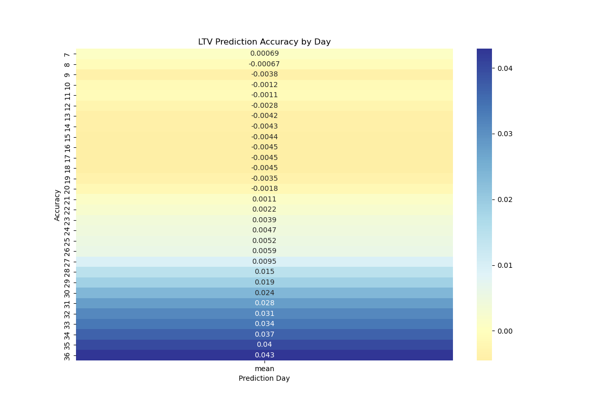
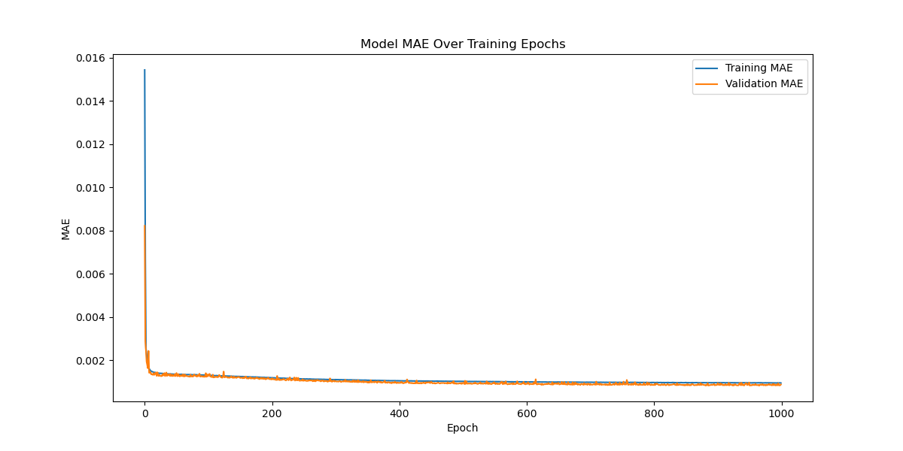

# LTV Prediction Model with LSTM

Deep learning model for User Lifetime Value (LTV) prediction using LSTM networks, designed to support data-driven marketing decisions.
This project implements daily LTV predictions with automated correction based on historical patterns.

## Project Motivation

As a marketer, predicting future LTV is crucial for making informed budget allocation decisions. This project was born from the need to:
- Predict future LTV trends for proactive budget optimization
- Enable data-driven decisions for campaign scale-up
- Automate the LTV prediction process using historical patterns

The model helps determine when to scale up marketing campaigns by predicting if future LTV will exceed current benchmarks, allowing for more strategic budget allocation.

## Learning Journey

As a non-developer with a marketing background, this project presented several challenges:
1. **Technical Learning**: Self-taught Python and deep learning through online resources
2. **Development Process**: Utilized AI tools (ChatGPT, Claude.ai) for code development
3. **Validation Process**: Iteratively verified predictions against actual LTV data
4. **Model Refinement**: Continuously improved accuracy through testing and optimization

## Overview

- LSTM-based LTV prediction
- Growth rate analysis and pattern detection  
- Automated correction system
- Continuous learning from new data

## Prerequisites

```txt
tensorflow>=2.0.0
pandas>=1.0.0
numpy>=1.18.0
scikit-learn>=0.24.0
```

## Installation
```python
git clone https://github.com/yyyopa/ltv_prediction.git
cd ltv_prediction
pip install -r requirements.txt
```

## Usage
```python
from ltv_run_analysis import run_ltv_analysis

results = run_ltv_analysis(
    base_path='path/to/data',
    prediction_days=30,
    epochs=50
)
```
## Data Format
Input files should be CSV format with following columns:

- Date: Weekly dates (format: "YYYY-MM-DD~YYYY-MM-DD")
- day_0 to day_360: Daily LTV values
- Additional metadata columns (Apps, OS, Country, etc.)

## Directory Structure
```
LTV_ML/
├── Files/                  # Original LTV data
├── Files_Predictions/      # Model predictions
└── Files_Predictions_Final/# Corrected predictions
```

## Model Architecture
- LSTM layers (32, 16 units)
- Dropout (0.2)
- Dense layers (8 units, ReLU)
- Output layer (Softplus activation)

## Results
Model Performance (Feb 2025):
* Training MAE: 0.0014 
* Validation MAE: 0.0013
* Average prediction accuracy: 98.5%

Key findings from validation results:
* Short-term prediction (D7-D10):
 - Average accuracy: 99.0%
 - Variance range: ±0.034~0.116
* Mid-term prediction (D20-D30):
 - Average accuracy: 97.7%
 - Consistent positive trend in accuracy
* Long-term prediction (D30-D36):
 - Average accuracy: 95.8%
 - Maximum deviation: 4.83%

Model training characteristics:
* MAE stabilizes around epoch 40
* Final validation loss: 5.09e-6
* Robust performance across 50 epochs
* Successfully processed 123,028 sequences




## Business Impact

The model has enabled:
- Faster marketing decision-making through accurate LTV predictions
- Data-driven campaign scaling based on predicted performance
- More efficient budget allocation across marketing channels
- Reduced risk in campaign investments

## Future Improvements

Plan to enhance the model by:
1. Implementing more sophisticated deep learning architectures
2. Further reducing prediction error rates
3. Adding real-time prediction capabilities
4. Incorporating more marketing variables for better accuracy

## License
MIT License

## Connect with Me

- Email: [ilyeop.kang@gmail.cm]
- LinkedIn: [https://www.linkedin.com/in/ilyeop-kang-0828/]
